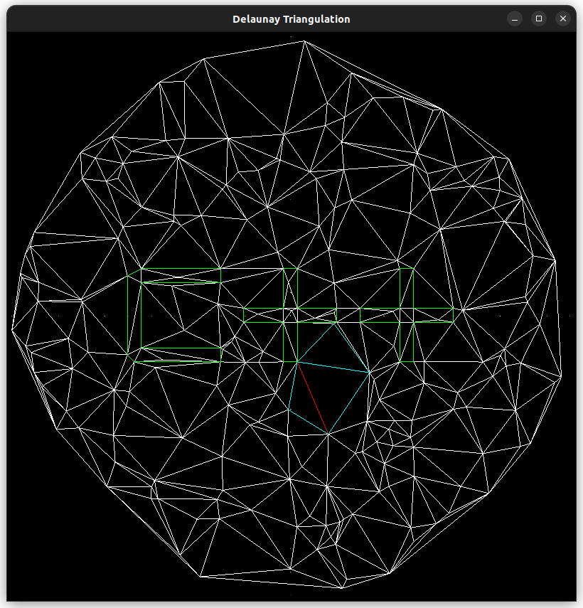

# Delaunay Triangulation Project

This project implements a Delaunay triangulation using C++ and SFML for graphical visualization. The goal is to build a program that handles triangulations and allows interactive visualization of the results.

## Requirements

Before running the project, make sure you have the following dependencies installed:

- **C++14** or higher.
- **CMake** 3.10 or higher.
- **SFML** (for graphics and window management).
  - `libsfml-graphics`
  - `libsfml-window`
  - `libsfml-system`

On Debian-based systems (Ubuntu, etc.), you can install SFML with the following command:

```bash
sudo apt-get install libsfml-dev
```

## Build and Run

Follow these steps to build and run the project:
### 1. Clone the repository

Clone the repository to your local machine:

```bash
git clone https://github.com/username/tri-ben.git
cd tri-ben
```

### 2. Configure and build the project

First, create a build directory and navigate to it:

```bash
mkdir build
cd build
```

Then, run CMake to configure the project:

```bash
cmake ..
```

This command will automatically detect the dependencies and configure the environment to build the project.

After the configuration, build the project using make:

```bash
make
```

This will generate the executable tri-ben.exe inside the build directory.
### 3. Run the program

Once the project is built, run the program with the following command:

```bash
./tri-ben.exe
```

This will open a window displaying the Delaunay triangulation.

## Project Structure

- **CMakeLists.txt**: CMake configuration file.
- **include/**: Directory containing header files (*.h) for the project's classes and functions.
- **src/**: Directory containing source code (*.cpp), where the main implementation of the Delaunay triangulation and visualization resides.
- **tri-ben.exe**: The generated executable.

## Build Options

The CMakeLists.txt file is configured with the following options:

- The C++ standard used is C++14.
- The -Wextra flag is enabled for extra warnings.
- The -O3 optimization flag is used for code optimization during the build.
- The tri-ben.exe executable is linked with the necessary SFML libraries (sfml-graphics, sfml-window, sfml-system).
- 
